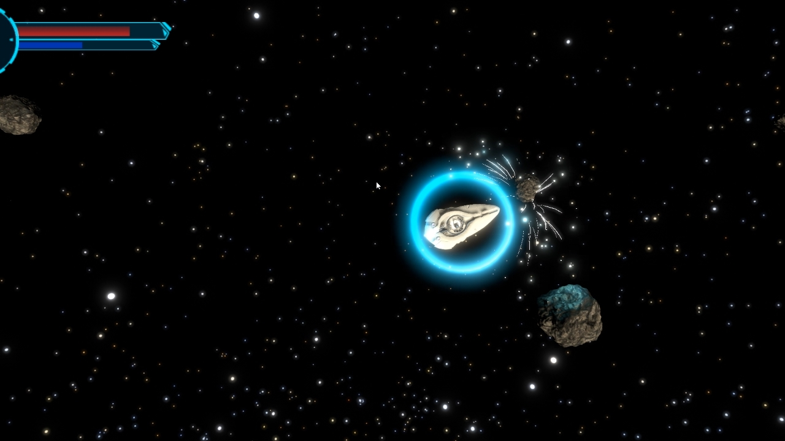

# Spaceship 3D Prototype

## Overview
This is a videogame prototype where the user controls a spaceship and must get rid of all the asteroids in order to move on to the next level.

Game is inspired by Comet Busters!
## Demo execution (video)
https://youtu.be/yZLFDgR2QDE

## Features
- This project has the following controls and mechanics.
  - WASD keys for character movement.
  - Space bar for shooting.
  - Left Control for Shield usage.
- The game features mirrored map edges
  - Whenever an object reached and edge, it will appear on the opposite side.
  - Unlike Comet Busters, which teleported the object, we display multiple objects at the same time.
- Heavy physics influence on asteroid collisions, shooting angles, etc.
- Shield bar can be restored over time, HP does not.

## Windows Build
You may find an executable Windows Build in the Builds folder or download it from here: https://drive.google.com/file/d/180hImK_26EFXJKe67aBo9OUv3RJU631r/view?usp=sharing

### Considerations:
Some details are still to be polished.
